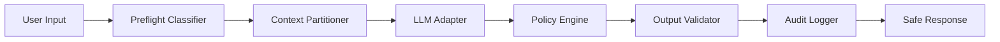

# PolicyRail Architecture

Portuguese translation: [architecture.pt-BR.md](./architecture.pt-BR.md)

This document explains how PolicyRail is organized internally and where teams are expected to extend it. The architecture is intentionally small: the library should be easy to drop into a new GenAI project without forcing the rest of the application into a rigid framework shape.

## Layered View

## Runtime Flow

1. User input and untrusted context are inspected by a preflight classifier.
2. The request is assembled into a prompt envelope with explicit trust boundaries.
3. The selected `LLMAdapter` generates text and may propose a tool call.
4. The `PolicyEngine` evaluates risk, tool policy, and approval thresholds.
5. The `OutputValidator` performs a final outbound check before the response leaves the system.
6. A minimized event is persisted through the audit logger.

## Core Contracts

### Request Contract

- `SecureRequest.user_input`: the primary user request
- `SecureRequest.system_instruction`: the system policy or system prompt
- `SecureRequest.trusted_context`: approved facts controlled by the application
- `SecureRequest.untrusted_context`: external or user-supplied context that must not gain authority
- `SecureRequest.metadata`: tenant, session, channel, and other operational tags

### Response Contract

- `SecureResponse.status`: `allow`, `review`, or `block`
- `SecureResponse.response_text`: the safe response returned to the caller
- `SecureResponse.risk`: aggregate score plus findings
- `SecureResponse.decision`: policy rationale
- `SecureResponse.tool_call`: approved tool call, when present
- `SecureResponse.audit_id`: identifier of the persisted audit event

## Extension Points

### 1. Main Model Integration

Implement `LLMAdapter` to connect the runtime model used for response generation. This is where you plug OpenAI, Azure OpenAI, Anthropic, Gemini, Bedrock, or an internal model gateway for the main application path.

PolicyRail is library-first here: it owns the secure orchestration, but it does not own your network stack, prompt store, or product-specific request lifecycle.

### 2. Preflight Classification

`PromptInjectionDetector` now consumes a pluggable classifier instead of relying on regex matching in the main path.

Available options:

- `LightweightNLPClassifier` for offline or dependency-free development
- `CallablePreflightClassifier` for structured custom classifiers
- `RemoteJudgePreflightClassifier` for remote binary judges
- `CallableVerdictClassifier` for custom judge endpoints or gateways

Built-in remote adapters currently cover:

- OpenAI
- Azure OpenAI
- Anthropic
- Google Gen AI / Gemini
- Amazon Bedrock

The factory `build_preflight_classifier_from_env` lets you choose the provider at deploy time through `POLICYRAIL_PREFLIGHT_PROVIDER` and `POLICYRAIL_PREFLIGHT_MODEL`.

### 3. Tool Policy

Use `ToolSpec` to classify tools into three broad categories:

- safe and auto-executable
- sensitive but reviewable
- denied by default

The policy layer should decide on tool execution, not the model alone.

### 4. Output Validation

`OutputValidator` is the last guardrail before the response exits the library. This is the right place to add:

- DLP checks
- PII masking
- citation validation
- domain-specific outbound filters

### 5. Audit Sinks

`JsonAuditLogger` is the default sink because it is portable and easy to inspect. Teams with stricter observability requirements can replace it with a custom audit sink that forwards events to SIEM, event buses, or internal logging platforms.

## Provider Strategy

PolicyRail is intentionally provider-agnostic at two different layers:

- response generation, through `LLMAdapter`
- preflight risk classification, through `PreflightClassifier` and remote judge adapters

That split matters. Many teams want to keep their main LLM provider and their security classifier on different cost, latency, or trust profiles. PolicyRail supports that separation directly.

Supported factory aliases:

- `openai`
- `azure`, `azure-openai`
- `anthropic`, `claude`
- `google`, `google-genai`, `gemini`
- `bedrock`, `aws`, `aws-bedrock`
- `lightweight`, `local`, `default`

## Failure Semantics

Remote preflight judges are designed to fail safely into a local fallback classifier when:

- the provider SDK is missing
- credentials or endpoint settings are missing
- the network call fails
- the provider returns an unexpected verdict

Unless you override it, the default fallback is `LightweightNLPClassifier`.

## Design Decisions

- No mandatory runtime dependencies in the base package.
- Standard Python packaging through `pyproject.toml`.
- JSONL as a simple, durable, low-friction audit format.
- Mock runtime adapter by default so the repository runs without external credentials.
- Preflight treated as a classification problem instead of brittle regex-only matching.
- Explicit data-vs-instruction boundaries to reduce silent prompt authority escalation.

## Recommended Adoption Sequence

1. Run the library with the mock adapter.
2. Replace it with your real model adapter.
3. Integrate your product's tool allowlist and approval rules.
4. Send audit events to your corporate observability stack.
5. Upgrade preflight from the local baseline to a remote judge.
6. Add domain-specific validation and risk enrichment.
