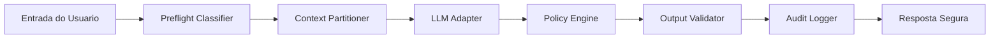

# Arquitetura do PolicyRail

English version: [architecture.md](./architecture.md)

Este documento explica como o `PolicyRail` esta organizado internamente e onde os times devem estender a biblioteca. A arquitetura foi mantida propositalmente pequena: a ideia e entrar em um novo projeto de GenAI sem forcar a aplicacao a adotar um framework pesado.

## Visao em Camadas

## Fluxo de Execucao

1. A entrada do usuario e o contexto nao confiavel passam por um classificador de preflight.
2. A requisicao e montada em um envelope com fronteiras explicitas de confianca.
3. O `LLMAdapter` selecionado gera texto e pode propor uma tool call.
4. O `PolicyEngine` avalia risco, policy de tools e limiares de aprovacao.
5. O `OutputValidator` faz a ultima verificacao antes da resposta sair do sistema.
6. Um evento minimizado e persistido no logger de auditoria.

## Contratos Principais

### Contrato de Entrada

- `SecureRequest.user_input`: pedido principal do usuario
- `SecureRequest.system_instruction`: policy ou prompt de sistema
- `SecureRequest.trusted_context`: fatos aprovados e controlados pela aplicacao
- `SecureRequest.untrusted_context`: contexto externo ou enviado pelo usuario que nao pode ganhar autoridade
- `SecureRequest.metadata`: tenant, sessao, canal e outras tags operacionais

### Contrato de Saida

- `SecureResponse.status`: `allow`, `review` ou `block`
- `SecureResponse.response_text`: resposta segura devolvida ao chamador
- `SecureResponse.risk`: score agregado com findings
- `SecureResponse.decision`: justificativa da policy
- `SecureResponse.tool_call`: tool aprovada, quando existir
- `SecureResponse.audit_id`: identificador do evento persistido

## Pontos de Extensao

### 1. Integracao do Modelo Principal

Implemente `LLMAdapter` para conectar o modelo usado na geracao da resposta. E aqui que entram OpenAI, Azure OpenAI, Anthropic, Gemini, Bedrock ou um gateway interno para o caminho principal da aplicacao.

O `PolicyRail` e library-first: ele orquestra o fluxo seguro, mas nao tenta controlar sua stack de rede, seu prompt store ou o ciclo de vida completo do seu produto.

### 2. Classificacao de Preflight

`PromptInjectionDetector` agora consome um classificador plugavel em vez de depender de regex no caminho principal.

Opcoes disponiveis:

- `LightweightNLPClassifier` para desenvolvimento offline ou sem dependencias
- `CallablePreflightClassifier` para classificadores customizados estruturados
- `RemoteJudgePreflightClassifier` para juizes remotos binarios
- `CallableVerdictClassifier` para endpoints ou gateways proprios

Os adapters remotos nativos atuais cobrem:

- OpenAI
- Azure OpenAI
- Anthropic
- Google Gen AI / Gemini
- Amazon Bedrock

A factory `build_preflight_classifier_from_env` permite escolher o provider em deploy por meio de `POLICYRAIL_PREFLIGHT_PROVIDER` e `POLICYRAIL_PREFLIGHT_MODEL`.

### 3. Policy de Tools

Use `ToolSpec` para classificar tools em tres grupos amplos:

- seguras e autoexecutaveis
- sensiveis, mas revisaveis
- negadas por default

A decisao de executar uma tool precisa ficar na camada de policy, nao apenas no modelo.

### 4. Validacao de Saida

`OutputValidator` e o ultimo guardrail antes da resposta deixar a biblioteca. Este e o lugar natural para incluir:

- checagens de DLP
- mascaramento de PII
- validacao de citacoes
- filtros especificos do negocio

### 5. Sinks de Auditoria

`JsonAuditLogger` e o sink default porque e portavel e simples de inspecionar. Times com requisitos maiores de observabilidade podem substitui-lo por um sink customizado que envie eventos para SIEM, event bus ou plataformas internas de logging.

## Estrategia Multi-Provider

O `PolicyRail` e agnostico a provider em duas camadas diferentes:

- geracao principal, via `LLMAdapter`
- classificacao de risco no preflight, via `PreflightClassifier` e adapters de judge remoto

Essa separacao e intencional. Muitos times querem usar um provedor para geracao e outro, mais barato ou mais controlado, para o classificador de seguranca. A biblioteca suporta isso diretamente.

Aliases suportados pela factory:

- `openai`
- `azure`, `azure-openai`
- `anthropic`, `claude`
- `google`, `google-genai`, `gemini`
- `bedrock`, `aws`, `aws-bedrock`
- `lightweight`, `local`, `default`

## Semantica de Falha

Os judges remotos de preflight foram desenhados para cair com seguranca em um classificador local de fallback quando:

- o SDK do provider nao esta instalado
- faltam credenciais ou configuracoes de endpoint
- a chamada remota falha
- o provider devolve um veredito inesperado

Se voce nao sobrescrever esse comportamento, o fallback default e `LightweightNLPClassifier`.

## Decisoes de Projeto

- Nenhuma dependencia obrigatoria de runtime no pacote base.
- Empacotamento Python padrao com `pyproject.toml`.
- JSONL como formato de auditoria simples, duravel e de baixo atrito.
- Mock adapter de runtime por default para rodar o repositorio sem credenciais externas.
- Preflight tratada como problema de classificacao, nao como matching fragil por regex.
- Fronteiras explicitas entre dado e instrucao para reduzir escalacao silenciosa de autoridade no prompt.

## Sequencia Recomendada de Adocao

1. Rode a biblioteca com o mock adapter.
2. Troque pelo adapter real do seu modelo.
3. Integre a allowlist de tools e as regras de aprovacao do produto.
4. Envie os eventos de auditoria para o stack corporativo.
5. Suba o preflight do baseline local para um judge remoto.
6. Adicione validadores e enriquecimento de risco do seu dominio.
